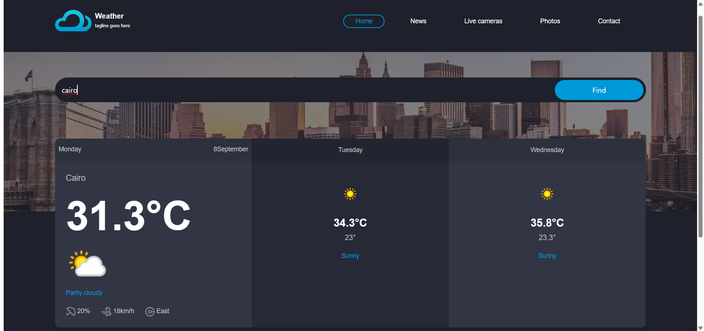

# ⛅ Weather App

A simple web application that displays the weather in any city around the world.  
The project was built using *HTML, CSS, Bootstrap, and JavaScript, with the help of **APIs* for weather data and geolocation.

---

## 🚀 Features
- Display current weather (temperature, humidity, wind speed).
- Search for weather by city name.
- Get weather based on the user’s current location.
- Responsive design using Bootstrap.

---

## 🛠 Technologies Used
- *HTML5*  
- *CSS3*  
- *Bootstrap*  
- *JavaScript*  
- *OpenWeatherMap API* (for weather data)  
- *Geolocation API* (for user location)  

---

## 📸 Screenshots

---

## 📌 Notes
 ⚠ The application may sometimes not respond correctly due to issues with the APIs, not because of the code itself.
